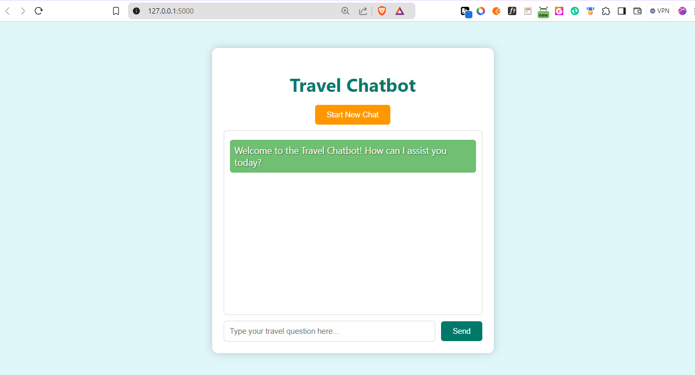
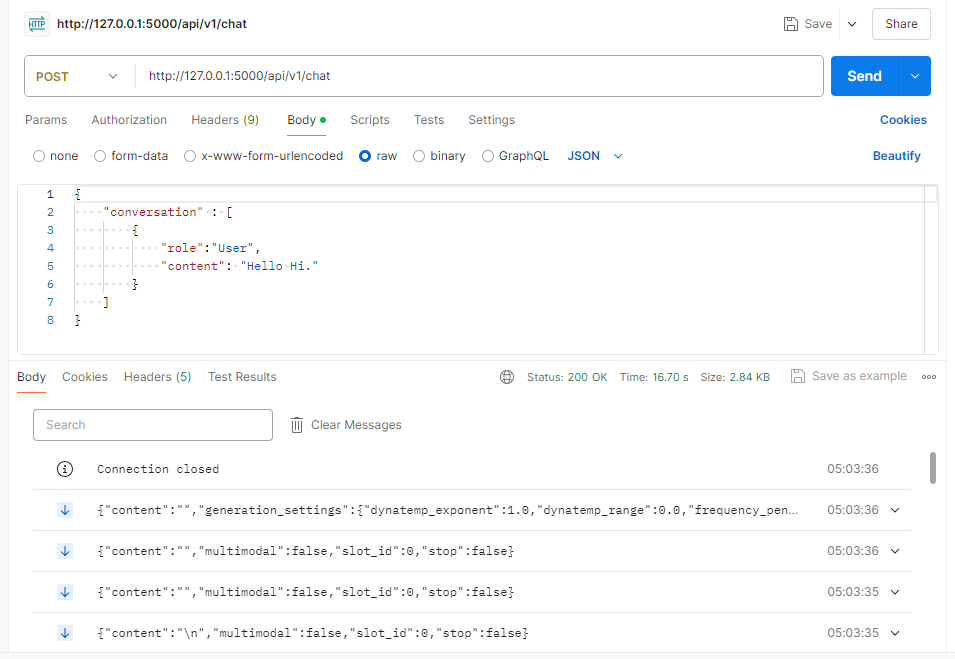

# Travel Assistant Chatbot


[](https://www.youtube.com/watch?v=your-video-id)

## Project Overview

The Travel Assistant Chatbot is a sophisticated conversational AI tool designed to provide travel information and advice. Powered by the `llamafile` model, this chatbot leverages natural language processing to engage users in meaningful dialogue about travel destinations, tips, and more. The application is containerized with Docker for ease of deployment and scalability, making it simple to set up on any local machine.

## Features

- **Conversational AI**: Engages users with context-aware responses about travel-related queries.
- **Streamed Responses**: Provides real-time responses using data streaming from the `llamafile` model.
- **Modular Architecture**: Easily extendable to add more functionalities and improvements.
- **Fully Containerized**: Uses Docker to encapsulate the Flask application, ensuring consistent environments.

## Architecture Diagram

```
+-----------------------------------------------------+
|                                                     |
|               Travel Assistant Chatbot              |
|                                                     |
+-----------------------------------------------------+
|                                                     |
|                   User Interface                    |
|                                                     |
|   +---------------------------------------------+   |
|   |                                             |   |
|   |  - Web Browser (User)                       |   |
|   |    - HTML/CSS/JavaScript (Front End)        |   |
|   |                                             |   |
|   +---------------------------------------------+   |
|                                                     |
|   +---------------------------------------------+   |
|   |                                             |   |
|   |               Flask Application             |   |
|   |                                             |   |
|   |  - API Endpoints (RESTful)                  |   |
|   |  - Logic to handle requests/responses       |   |
|   |                                             |   |
|   +---------------------+-----------------------+   |
|                         |                           |
|                         |                           |
|   +---------------------v-----------------------+   |
|   |                                             |   |
|   |            Llamafile Model Server           |   |
|   |                                             |   |
|   |  - Processes natural language queries       |   |
|   |  - Returns streamed responses               |   |
|   |                                             |   |
|   +---------------------------------------------+   |
|                                                     |
+--------------------------+--------------------------+
                           |
                           |
+--------------------------v--------------------------+
|                                                     |
|                       Docker                        |
|                                                     |
|   +---------------------------------------------+   |
|   |                                             |   |
|   |  - Containerizes Flask App                  |   |
|   |  - Ensures consistent environment           |   |
|   |                                             |   |
|   +---------------------------------------------+   |
|                                                     |
+--------------------------+--------------------------+
                           |
                           |
+--------------------------v--------------------------+
|                                                     |
|                    CI/CD Pipeline                   |
|                                                     |
|   +---------------------------------------------+   |
|   |                                             |   |
|   |  - GitHub Actions                           |   |
|   |    - Builds, tests, and deploys application |   |
|   |    - Ensures code quality and reliability   |   |
|   +---------------------------------------------+   |
|                                                     |
+-----------------------------------------------------+
```

## Prerequisites

Before setting up the application, ensure you have the following installed:

- **Docker**: Install Docker from [Docker's official website](https://www.docker.com/get-started).
- **Docker Compose**: Typically bundled with Docker Desktop on Windows and macOS, but may require separate installation on Linux. Check [here](https://docs.docker.com/compose/install/) for installation instructions.
- **Python 3.9+**: Ensure Python is installed on your system. Download from [python.org](https://www.python.org/downloads/).
- **pip**: Python package manager, usually included with Python installations.

## Installation and Setup

### 1. Clone the Repository

Begin by cloning the repository to your local machine:

```bash
git clone https://github.com/changyuhsin1999/Travel_Assistant.git
cd Travel_Assistant
```

### 2. Install Python Dependencies

Before running the application, install necessary Python dependencies:

```bash
pip install -r requirements.txt
```

### 3. Prepare the Llamafile Model

   Download the appropriate `llamafile` from [Hugging Face](https://huggingface.co/models?other=llamafile) or ensure you have the `mistral-7b-instruct-v0.2.Q4_0.llamafile` executable.

   Place the executable in the `models` directory.

### Running the Llamafile with a Multi-OS Script

   Use the provided Python script to run the `llamafile` on your system:

   ```bash
   python models/run_llamafile.py models/mistral-7b-instruct-v0.2.Q4_0.llamafile
   ```

   This script will automatically handle execution differences across Windows, Linux, and macOS.


### 5. Run the Docker Container for the Flask App

Use Docker Compose to build and start the Flask application:

```bash
docker-compose up --build
```

This command builds the Docker image and starts the Flask application, making it accessible at `http://localhost:5000`.

### 6. Access the Application

Open a web browser and navigate to:

```
http://localhost:5000
```

Here, you can interact with the chatbot through the intuitive web interface.

## Usage

### Interacting with the Chatbot

#### Example Chat Sessions

- **User**: "What are the best beaches in Hawaii?"
  - **Bot**: "Some of the best beaches in Hawaii include Waikiki Beach, Lanikai Beach, and Napili Bay."

- **User**: "What travel documents do I need for Japan?"
  - **Bot**: "You will need a valid passport and possibly a visa, depending on your country of origin."

### Screenshots

- **Chat Interface**: 
- **Response Streaming**: 

## Testing

Unit tests ensure the application functions as expected. Tests are located in the `tests` directory. Run tests using `pytest`:

```bash
pytest tests/
```

For test coverage, you can use:

```bash
pytest --cov=app tests/
```

This will provide insights into how much of your code is covered by the tests.

## Performance Evaluation

### Key Metrics

- **Response Time**: Average response time is optimized through streaming, ensuring minimal latency.
- **Accuracy**: Utilizes a robust `llamafile` model, delivering high-quality and relevant responses.

### Observations

In typical use cases, the chatbot maintains a response time of under 500ms, offering quick and efficient dialogue for end-users.

## CI/CD Pipeline

Our CI/CD pipeline is configured using GitHub Actions, ensuring continuous integration and delivery through:

- **Automated Testing**: Runs all tests on each push to the repository.
- **Build and Deployment**: Automates Docker image builds and ensures seamless deployment.
